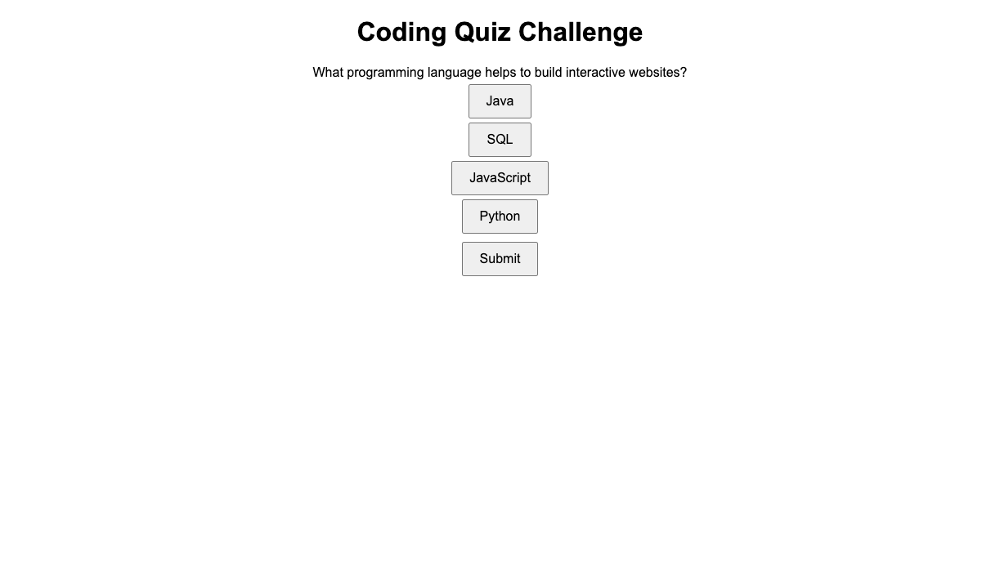
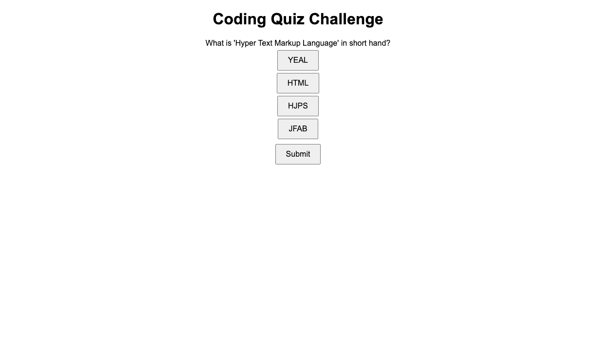
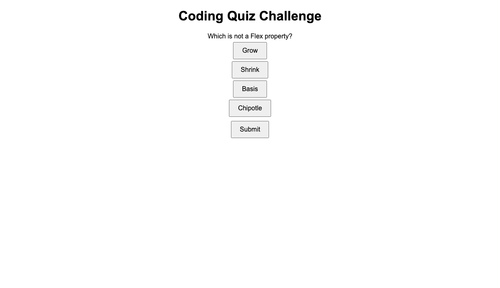
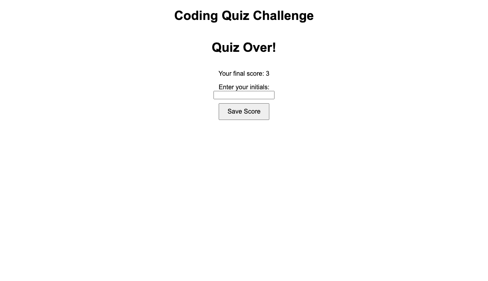

# Coding Quiz Challenge!

## Description
using the skillsets learned over the course of HTML, CSS, and JavaScript to create and apply to a coding quiz. This application will allow users to practice their coding knowledge. 

## Acceptance Criteria
- When I open up browser to take the coding quiz
- I am able to click the start button
- A timer will then start and I am presented with a question
- When I answer a question
- I am then presented with another question
- If I answer a question incorrectly
- Time is then subtracted from the clock
- When all of the questions are answered or the timer reaches 0
- We then know that the game is over
- When the game is over
- I am able to save my initials and score

## Coding Quiz Screenshots
.png>)
Opening page

Question 1!

Question 2!

Question 3!

Initials and Score

## Link to Deployed Attributes
https://hjenp22.github.io/CodingChallenger/
 
## About the Author
- Email: hjipark22@gmail.com
- Github: hjenp22
